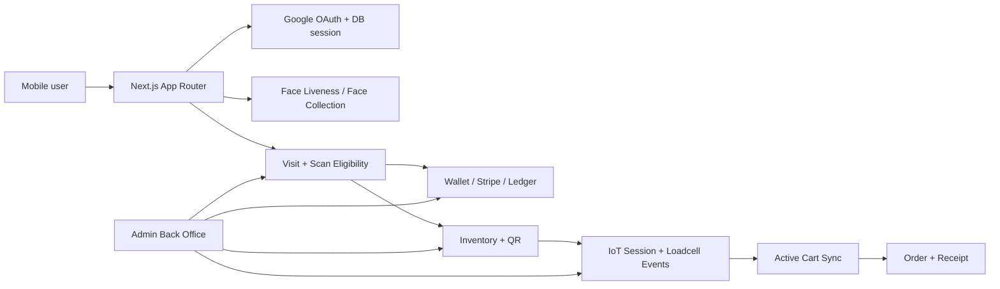

# 01 — Overview

Generated: 2026-07-15 Asia/Bangkok

## Project Summary

**ATK Store** เป็น mobile-first smart-store prototype ที่ผูก identity, face verification, wallet, inventory QR และ IoT shelf/session เข้าด้วยกัน ลูกค้า sign in, ลงทะเบียนหน้า, เข้า store ผ่าน camera/attendance, เติม wallet, scan QR ของ inventory, เปิด session กับตู้/อุปกรณ์ IoT, ให้ loadcell event อัปเดต cart แล้ว checkout ด้วย wallet ตอนออกจากร้าน

## Tech Stack

| Area | Choice | Notes |
| --- | --- | --- |
| Framework | Next.js 16.2.9 App Router | ใช้ Server Components, Route Handlers, Server Actions และ src/proxy.ts |
| UI | React 19.2.4, Tailwind CSS v4, shadcn/ui, Base UI | mobile-first, Thai UI |
| DB | PostgreSQL + Drizzle ORM | schema อยู่ที่ src/db/schema.ts |
| Auth | Google OAuth + jose | manual state/PKCE/nonce flow และ DB session cookie |
| Face | Amazon Rekognition Face Liveness/Face Collection + Cognito Identity Pool | browser ได้ temporary detector credentials เท่านั้น |
| Payment | Stripe Checkout/Webhook | wallet top-up และ ledger |
| IoT | HTTP route + MQTT worker + SSE | loadcell events, session updates, mock server |
| Redis | redis package, optional | active cart persistence และ IoT pub/sub fan-out เมื่อ REDIS_HOST พร้อม |

## Current Domain Map

| Domain | What It Does |
| --- | --- |
| Authentication | Google OAuth manual flow, DB-backed opaque session cookie, role/permission helpers. |
| Face | Amazon Rekognition Face Liveness + Face Collection สำหรับ enrollment และ verification. |
| Store Visit | Camera attendance API จัดการ entry/exit และ active visit ก่อนให้ scan ได้. |
| Wallet/Payment | Wallet ledger, Stripe Checkout top-up, webhook และ wallet debit ตอน checkout. |
| Inventory/QR | Admin inventory, unit, QR เดี่ยว/grouped QR และ scan eligibility. |
| IoT | IoT session, loadcell events, MQTT worker, SSE updates และ mock IoT backdoor. |
| Order/Receipt | active cart → order → receipt โดยผูกกับ visit และ wallet checkout. |
| Admin | หลังบ้าน users, wallets, attendance, inventory, receipt settings, orders และ PoC tools. |

## Runtime Architecture

## Important Conditions

- ทุก private page ต้อง resolve user ผ่าน `getCurrentUser()` หรือ redirect ไป `/signin`
- API/Server Action ที่แก้ข้อมูลต้องใช้ `requireCurrentUser()`, same-origin/API key checks, role checks หรือ resource ownership ตาม context
- Scan ได้เมื่อมี active visit, wallet พร้อม, balance เพียงพอกับราคาสินค้าขั้นต่ำ และมี inventory ที่ขายได้
- Face enrollment/verification ไม่ควรสร้าง AWS session อัตโนมัติ ต้องให้ผู้ใช้กดเริ่มก่อน
- IoT session/cart updates ต้อง idempotent เพราะ events อาจมาจาก HTTP mock, MQTT worker หรือ retry
- Redis เป็น optional infrastructure: ถ้ามี `REDIS_HOST` จะใช้ cross-process; ถ้าไม่มี/ล่มบางจุดจะ fallback local แต่จะไม่ fan-out ข้าม process

## Scripts

| Script | Command | Purpose |
| --- | --- | --- |
| dev | next dev | app tooling |
| iot:mqtt | tsx script/iot-mqtt-worker.ts | MQTT worker |
| build | next build | app tooling |
| start | next start | app tooling |
| lint | eslint | app tooling |
| test | vitest run | test |
| test:watch | vitest | test |
| format | prettier --write . | app tooling |
| db:generate | drizzle-kit generate | database tooling |
| db:migrate | drizzle-kit migrate | database tooling |
| db:push | drizzle-kit push | database tooling |
| db:seed | tsx src/db/seed.ts | database tooling |
| db:studio | drizzle-kit studio | database tooling |

## Glossary

- **Active visit**: visit ที่ camera/attendance ระบุว่าลูกค้ายังอยู่ในร้าน
- **Cart sync**: server-side active cart ผูกกับ visit/session ใช้ Redis หรือ memory fallback
- **Face Collection**: Rekognition collection ที่เก็บ AWS-managed face features ไม่ใช่ raw selfie ใน DB
- **Grouped QR**: QR เดียวที่เปิดรายการ inventory หลายตัวให้เลือกก่อนหยิบ
- **IoT session**: session ต่อการ scan/open inventory ใช้รับ loadcell/door/error events
- **Backdoor/mock**: หน้า/API สำหรับจำลอง status หรือ event ระหว่าง demo/dev ไม่ใช่ public production flow
