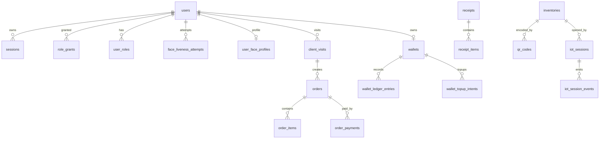

# 04 — Data Model

Generated: 2026-07-15 Asia/Bangkok

Source: `src/db/schema.ts`

## Tables

| Symbol | Database Table | Domain |
| --- | --- | --- |
| users | users | auth/admin |
| roles | roles | auth/admin |
| userRoles | user_roles | auth/admin |
| roleGrants | role_grants | auth/admin |
| adminAuditLogs | admin_audit_logs | auth/admin |
| sessions | sessions | auth/admin |
| faceLivenessAttempts | face_liveness_attempts | face |
| userFaceProfiles | user_face_profiles | face |
| clientAttendanceEvents | client_attendance_events | attendance/visit |
| clientVisits | client_visits | attendance/visit |
| units | units | inventory/qr |
| inventories | inventories | inventory/qr |
| qrCodes | qr_codes | inventory/qr |
| orders | orders | order/receipt |
| orderItems | order_items | order/receipt |
| storeSettings | store_settings | order/receipt |
| receipts | receipts | order/receipt |
| receiptItems | receipt_items | order/receipt |
| iotSessions | iot_sessions | iot |
| iotSessionEvents | iot_session_events | iot |
| iotMqttMessageLogs | iot_mqtt_message_logs | iot |
| wallets | wallets | wallet/payment |
| walletLedgerEntries | wallet_ledger_entries | wallet/payment |
| stripeCustomers | stripe_customers | wallet/payment |
| walletFundingChannels | wallet_funding_channels | wallet/payment |
| walletTopupIntents | wallet_topup_intents | wallet/payment |
| stripeWebhookEvents | stripe_webhook_events | wallet/payment |
| orderPayments | order_payments | order/receipt |
| notifications | notifications | system |

## Enums / States

| Symbol | Database Enum |
| --- | --- |
| authMethodEnum | auth_method |
| userAccountStatusEnum | user_account_status |
| roleGrantStatusEnum | role_grant_status |
| faceEnrollmentStatusEnum | face_enrollment_status |
| livenessAttemptStatusEnum | liveness_attempt_status |
| faceLivenessIntentEnum | face_liveness_intent |
| faceRecognitionOutcomeEnum | face_recognition_outcome |
| attendanceDirectionEnum | attendance_direction |
| attendanceRecognitionDecisionEnum | attendance_recognition_decision |
| clientVisitStatusEnum | client_visit_status |
| orderStatusEnum | order_status |
| paymentStatusEnum | payment_status |
| walletStatusEnum | wallet_status |
| walletLedgerDirectionEnum | wallet_ledger_direction |
| walletLedgerTypeEnum | wallet_ledger_type |
| walletFundingProviderEnum | wallet_funding_provider |
| walletFundingChannelEnum | wallet_funding_channel |
| walletTopupStatusEnum | wallet_topup_status |
| stripeWebhookProcessingStatusEnum | stripe_webhook_processing_status |
| orderPaymentMethodEnum | order_payment_method |
| receiptStatusEnum | receipt_status |
| notificationRecipientTypeEnum | notification_recipient_type |
| notificationSeverityEnum | notification_severity |
| iotSessionStatusEnum | iot_session_status |
| iotSessionEventMessageKindEnum | iot_session_event_message_kind |
| iotSessionEventTypeEnum | iot_session_event_type |
| iotMqttMessageProcessingStatusEnum | iot_mqtt_message_processing_status |

## Business State Notes

- `users.account_status` แยก active/blocked/disabled ออกจาก roles
- `users.face_enrollment_status` เป็น source of truth ให้ UI prompt หลัง sign-in
- `face_liveness_attempts.status` และ `recognition_outcome` ทำให้ result endpoint idempotent
- `client_visits.status` เป็นตัวบอกว่าลูกค้าอยู่ในร้านหรือออกแล้ว
- `orders.payment_status`, `order_payments`, `wallet_ledger_entries` ใช้ reconcile checkout ผ่าน wallet
- `wallet_topup_intents` และ `stripe_webhook_events` ช่วยให้ Stripe webhook replay-safe
- `iot_sessions.status` และ `iot_session_events` เก็บ lifecycle ของการหยิบสินค้าจากตู้/ชั้น
- `iot_mqtt_message_logs` เก็บ raw/normalized MQTT payload พร้อม processing status เพื่อ debug/replay

## Relationship Sketch

## Inferred Types

- `Inventory`
- `NewInventory`
- `QrCode`
- `Unit`
- `NewUnit`
- `Order`
- `OrderItem`
- `StoreSettings`
- `Receipt`
- `ReceiptItem`
- `IotSessionRecord`
- `NewIotSessionRecord`
- `IotSessionEventRecord`
- `NewIotSessionEventRecord`
- `IotMqttMessageLogRecord`
- `NewIotMqttMessageLogRecord`
- `Wallet`
- `NewWallet`
- `WalletLedgerEntry`
- `NewWalletLedgerEntry`
- `StripeCustomer`
- `NewStripeCustomer`
- `WalletFundingChannel`
- `WalletTopupIntent`
- `NewWalletTopupIntent`
- `StripeWebhookEvent`
- `OrderPayment`
- `Notification`
- `User`
- `NewUser`
- `Session`
- `Role`
- `UserRole`
- `RoleGrant`
- `AdminAuditLog`
- `FaceLivenessAttempt`
- `NewFaceLivenessAttempt`
- `UserFaceProfile`
- `NewUserFaceProfile`
- `ClientAttendanceEvent`
- `NewClientAttendanceEvent`
- `ClientVisit`
- `NewClientVisit`
- `AuthMethod`
- `UserAccountStatus`
- `RoleGrantStatus`
- `FaceEnrollmentStatus`
- `LivenessAttemptStatus`
- `FaceLivenessIntent`
- `FaceRecognitionOutcome`
- `AttendanceDirection`
- `AttendanceRecognitionDecision`
- `ClientVisitStatus`
- `WalletStatus`
- `WalletLedgerDirection`
- `WalletLedgerType`
- `WalletFundingChannelCode`
- `WalletTopupStatus`
- `ReceiptStatus`
