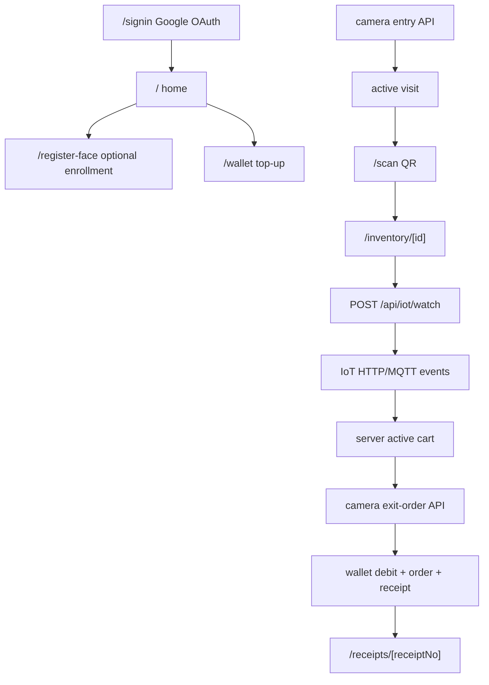

# 05 — Routes & Request Flow

Generated: 2026-07-15 Asia/Bangkok

## Pages

| Route | Rendering | File | Description |
| --- | --- | --- | --- |
| / | Server | src/app/page.tsx | Home หลัง sign-in แสดงสถานะ face, checkout notice, scan eligibility และทางเข้า scan/cart |
| /admin | Server | src/app/admin/page.tsx | Dashboard หลังบ้านสำหรับ admin/super admin |
| /admin/attendance | Server | src/app/admin/attendance/page.tsx | backdoor/mock หน้า attendance สำหรับทดสอบ entry/exit/status |
| /admin/inventory | Server | src/app/admin/inventory/page.tsx | หลังบ้าน inventory overview |
| /admin/inventory/groups | Server | src/app/admin/inventory/groups/page.tsx | redirect compatibility ไปหน้า QR/groups ใหม่ |
| /admin/inventory/iot-poc | Server | src/app/admin/inventory/iot-poc/page.tsx | backdoor/mock ส่ง IoT/MQTT event และจำลองสถานะ loadcell |
| /admin/inventory/items | Server | src/app/admin/inventory/items/page.tsx | จัดการ inventory items |
| /admin/inventory/orders | Server | src/app/admin/inventory/orders/page.tsx | ดู orders และสถานะคำสั่งซื้อ |
| /admin/inventory/qr | Server | src/app/admin/inventory/qr/page.tsx | สร้าง/จัดการ QR สำหรับ inventory เดี่ยวหรือ grouped QR |
| /admin/inventory/receipt-settings | Server | src/app/admin/inventory/receipt-settings/page.tsx | ตั้งค่า store/receipt |
| /admin/inventory/shelfs | Server | src/app/admin/inventory/shelfs/page.tsx | redirect compatibility ของคำว่า shelfs |
| /admin/inventory/units | Server | src/app/admin/inventory/units/page.tsx | จัดการหน่วยสินค้า |
| /admin/users | Server | src/app/admin/users/page.tsx | จัดการ user, account status และ roles |
| /admin/users/[id] | Server | src/app/admin/users/[id]/page.tsx | รายละเอียด user, roles, wallet และ audit context |
| /admin/wallets | Server | src/app/admin/wallets/page.tsx | ตรวจ wallet และ ledger ในระบบหลังบ้าน |
| /cart | Client | src/app/cart/page.tsx | ตะกร้าของ active visit อ่านจาก server-side cart sync และรอ checkout จาก exit camera |
| /inventory/[id] | Server | src/app/inventory/[id]/page.tsx | หน้ารายละเอียด inventory และเปิด IoT session เพื่อหยิบสินค้า |
| /receipts | Server | src/app/receipts/page.tsx | รายการ receipts ของผู้ใช้ |
| /receipts/[receiptNo] | Server | src/app/receipts/[receiptNo]/page.tsx | รายละเอียด receipt และเอกสารใบเสร็จ |
| /register-face | Server | src/app/register-face/page.tsx | หน้าลงทะเบียน Face Liveness สำหรับผู้ใช้ที่ยังไม่ registered |
| /scan | Server | src/app/scan/page.tsx | หน้าเปิดกล้อง scan inventory/grouped QR โดยตรวจ store eligibility ก่อน |
| /scan/inventories | Server | src/app/scan/inventories/page.tsx | หน้ารายการ inventory สำหรับ fallback/manual scan flow |
| /scan/shelves | Server | src/app/scan/shelves/page.tsx | หน้า legacy/backdoor ของ shelves catalog |
| /shelf/[id] | Server | src/app/shelf/[id]/page.tsx | หน้า shelf legacy compatibility |
| /signin | Server | src/app/signin/page.tsx | หน้า Google sign-in และ error message จาก OAuth callback |
| /unsupported-device | Server | src/app/unsupported-device/page.tsx | หน้าแจ้งว่าฟีเจอร์ scan/inventory/cart ใช้ได้เฉพาะ mobile/tablet |
| /verify-face | Server | src/app/verify-face/page.tsx | หน้า debug สำหรับ verify face เมื่อเปิด ENABLE_FACE_RECOGNITION_DEBUG |
| /wallet | Server | src/app/wallet/page.tsx | หน้า wallet, balance, ledger และสร้าง Stripe top-up |
| /wallet/topup/success | Server | src/app/wallet/topup/success/page.tsx | หน้า redirect หลัง Stripe Checkout submit |

## Route Handlers

| Methods | Route | File | Description |
| --- | --- | --- | --- |
| GET | /api/animation-api/users | src/app/api/animation-api/users/route.ts | API สำหรับ animation/demo user feed |
| GET | /api/auth/callback/google | src/app/api/auth/callback/google/route.ts | รับ OAuth callback, validate ID token, upsert user และเปิด DB session |
| GET | /api/auth/signin/google | src/app/api/auth/signin/google/route.ts | เริ่ม Google OAuth ด้วย state, PKCE และ nonce cookies |
| POST | /api/auth/signout | src/app/api/auth/signout/route.ts | ปิด session และ clear cookies |
| GET | /api/cart/active | src/app/api/cart/active/route.ts | อ่าน active cart จาก cart sync |
| POST | /api/client-attendance/exit-order | src/app/api/client-attendance/exit-order/route.ts | Camera API สำหรับ exit แล้ว trigger wallet checkout |
| POST | /api/client-attendance/recognize | src/app/api/client-attendance/recognize/route.ts | Camera API สำหรับ entry/sighting recognition |
| GET | /api/face/auth-status | src/app/api/face/auth-status/route.ts | ตรวจ token bridge สำหรับ Face Liveness แบบไม่เรียก AWS |
| GET | /api/face/credentials | src/app/api/face/credentials/route.ts | แลก Google ID token cookie เป็น Cognito temporary credentials |
| POST | /api/face/result | src/app/api/face/result/route.ts | อ่านผล liveness และ register/verify กับ Face Collection |
| POST | /api/face/session | src/app/api/face/session/route.ts | สร้าง/reuse Rekognition Face Liveness session สำหรับ enrollment/verification |
| GET | /api/health-check | src/app/api/health-check/route.ts | health check endpoint |
| GET | /api/iot/catalog/inventories | src/app/api/iot/catalog/inventories/route.ts | catalog inventory สำหรับ scan/admin |
| GET | /api/iot/catalog/shelves | src/app/api/iot/catalog/shelves/route.ts | legacy shelf catalog endpoint ที่ตอบ gone/removed |
| POST | /api/iot/events | src/app/api/iot/events/route.ts | รับ IoT/loadcell event จากอุปกรณ์หรือ worker |
| POST | /api/iot/mock-events | src/app/api/iot/mock-events/route.ts | backdoor/mock ส่ง IoT event จาก browser/admin |
| GET | /api/iot/sessions/[sessionId] | src/app/api/iot/sessions/[sessionId]/route.ts | อ่านสถานะ IoT session |
| GET | /api/iot/sessions/[sessionId]/events | src/app/api/iot/sessions/[sessionId]/events/route.ts | SSE แจ้ง IoT session updates |
| POST | /api/iot/watch | src/app/api/iot/watch/route.ts | เปิด IoT watch/session หลัง scan inventory QR |
| POST | /api/mock-iot-server/pick-sessions | src/app/api/mock-iot-server/pick-sessions/route.ts | mock IoT server ดึง pick sessions |
| GET | /api/mock-iot-server/product/[productId] | src/app/api/mock-iot-server/product/[productId]/route.ts | mock IoT server อ่าน product config สำหรับอุปกรณ์จำลอง |
| POST | /api/mock-iot-server/shelves/open | src/app/api/mock-iot-server/shelves/open/route.ts | legacy mock shelf open endpoint ที่ถูกถอดออก |
| GET | /api/orders/active-visit-events | src/app/api/orders/active-visit-events/route.ts | SSE แจ้ง active visit/cart/checkout changes |
| GET | /api/orders/active-visit-status | src/app/api/orders/active-visit-status/route.ts | อ่าน active visit/cart/checkout status ของผู้ใช้ |
| POST | /api/qr/decode | src/app/api/qr/decode/route.ts | decode QR payload/image สำหรับ scan flow |
| GET | /api/shelf/[id] | src/app/api/shelf/[id]/route.ts | legacy shelf endpoint ที่ตอบ gone/removed |
| POST | /api/stripe/webhook | src/app/api/stripe/webhook/route.ts | รับ Stripe webhook สำหรับ wallet top-up |
| GET | /inventories | src/app/inventories/route.ts | alias compatibility ของ inventory catalog |

## Server Actions

| File | Exports | Purpose |
| --- | --- | --- |
| src/app/admin/actions.ts | blockUserAction, createQrCodeAction, deleteInventoryAction, deleteQrCodeAction, deleteUnitAction, disableUserAction, grantAdminRoleAction, importInventoriesAction, resetFaceEnrollmentAction, revokeAdminRoleAction, saveInventoryAction, saveUnitAction, setManualAttendanceStatusAction, unblockUserAction | Server Actions สำหรับ admin user, roles, face reset, attendance override, inventory/unit/QR |
| src/app/admin/inventory/iot-poc/actions.ts | sendMockDoorClosedAction, sendMockFinalCountAction, sendMockPickedCountAction | Server Actions สำหรับส่ง mock IoT/MQTT events |
| src/app/admin/inventory/receipt-settings/actions.ts | updateReceiptSettingsAction | Server Action สำหรับบันทึก receipt/store settings |
| src/app/wallet/actions.ts | createWalletTopupAction | Server Action สำหรับสร้าง Stripe wallet top-up |

## Primary Customer Flow

## Admin / Backdoor Flow

- `/admin/attendance` ใช้ดูและ mock attendance/visit status
- `/admin/inventory/iot-poc` ใช้ mock IoT/loadcell/MQTT events
- `/api/iot/mock-events` และ `/api/mock-iot-server/*` เป็น endpoints สำหรับ dev/demo/mock server
- `/verify-face` เป็น debug page ที่ต้องเปิด env flag และ user ต้องมี face profile แล้ว

## Route Protection

- `src/proxy.ts` ทำ redirect แบบ optimistic สำหรับ page routes โดยดู cookie presence
- API/private actions ต้อง guard จริงด้วย `requireCurrentUser()`, role checks, same-origin หรือ API key ตาม use case
- Camera attendance endpoint ใช้ `x-client-attendance-api-key`
- IoT API ใช้ helper ใน `src/lib/iot-api-auth.ts` สำหรับ device/mock integration

## Redis Behavior

- `src/services/cart-sync.service.ts` ใช้ Redis เมื่อมี `REDIS_HOST` เพื่อเก็บ active cart และ active session key; ถ้า Redis ล่มจะ fallback memory เพื่อให้ local/mobile demo ยังใช้งานได้ใน process เดียว
- `src/services/iot-session-events.service.ts` ใช้ Redis pub/sub เพื่อ fan-out SSE update ข้าม process; ถ้า Redis ไม่พร้อม local listener ยังทำงานใน process เดียว แต่หลาย instance จะไม่เห็น event กัน
