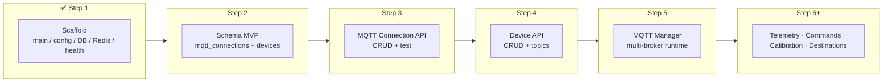

# Multi-Device Load Cell Platform

ระบบสำหรับจัดการเครื่องชั่ง Load Cell หลายเครื่อง โดยใช้ ESP32, HX711, OLED, MQTT, Web Configuration, Calibration, Realtime Monitoring และรองรับการส่งข้อมูลไปยัง REST API หรือ Database ปลายทางที่กำหนดได้แยกอิสระต่อ Device

---

## 1. ภาพรวมระบบ

```text
ESP32 + HX711 + OLED
        │
        │ MQTT Publish
        ▼
MQTT Broker ของแต่ละ Device
        │
        ▼
Load Cell Gateway Service
        │
        ├── MQTT Connection Manager
        ├── Payload Parser
        ├── Device Command Service
        ├── Calibration Service
        ├── Field Mapping
        ├── Validation
        ├── Data Transformation
        ├── Retry Queue
        └── Destination Router
                │
                ├── Internal Database
                ├── REST API
                ├── PostgreSQL
                ├── SQL Server
                ├── MySQL
                ├── Oracle
                ├── MongoDB
                └── MQTT Broker อื่น
```

แต่ละ Device สามารถตั้งค่าได้อิสระ เช่น

```text
เครื่องชั่ง A → MQTT Broker A → PostgreSQL กลาง
เครื่องชั่ง B → MQTT Broker B → REST API ของลูกค้า
เครื่องชั่ง C → MQTT Broker C → SQL Server Production
เครื่องชั่ง D → MQTT Broker A → REST API + Database พร้อมกัน
```

---

## 2. ความสามารถหลัก

- รองรับ Load Cell หลายเครื่อง
- แต่ละเครื่องใช้ MQTT Broker คนละตัวได้
- แต่ละเครื่องกำหนด MQTT Topic ได้เอง
- ตั้งค่า MQTT Username, Password, TLS และ Certificate ได้
- แสดงน้ำหนัก Realtime บน Web
- อ่านค่าน้ำหนักล่าสุดผ่าน API
- สั่งอ่านค่าน้ำหนักสดจาก Device ผ่าน MQTT
- Tare, Zero, Restart และ Calibration ผ่าน Web
- ตั้งค่า Payload Parser แยกตาม Device
- ตั้งค่าให้ส่งข้อมูลไป REST API ได้
- ตั้งค่า Authentication ของ API ได้
- ตั้งค่า Database ปลายทางได้
- เลือก Schema, Table และ Column ได้
- Map Field จากข้อมูลเครื่องไปยัง API หรือ Database ได้
- กำหนด Trigger การส่งข้อมูลได้
- Retry เมื่อปลายทางใช้งานไม่ได้
- เก็บ Delivery Log และ Audit Log
- รองรับ OTA Firmware ในอนาคต
- รองรับ Offline Queue ในอนาคต

---

# 3. MQTT Connection Management

ระบบ Backend ต้องไม่ผูกกับ MQTT Broker เพียงตัวเดียว แต่ต้องสามารถเปิด Connection หลาย Broker พร้อมกันได้

## ตาราง `mqtt_connections`

```sql
CREATE TABLE mqtt_connections (
    id UUID PRIMARY KEY,
    connection_name VARCHAR(255) NOT NULL,

    protocol VARCHAR(20) DEFAULT 'mqtt',
    host VARCHAR(255) NOT NULL,
    port INTEGER NOT NULL DEFAULT 1883,

    username VARCHAR(255),
    password_encrypted TEXT,

    client_id_prefix VARCHAR(100),

    use_tls BOOLEAN DEFAULT FALSE,
    ca_certificate TEXT,
    client_certificate TEXT,
    client_private_key_encrypted TEXT,

    connect_timeout_seconds INTEGER DEFAULT 10,
    keep_alive_seconds INTEGER DEFAULT 60,
    reconnect_interval_seconds INTEGER DEFAULT 5,

    enabled BOOLEAN DEFAULT TRUE,
    connection_status VARCHAR(20) DEFAULT 'offline',
    last_connected_at TIMESTAMPTZ,
    last_error TEXT,

    created_at TIMESTAMPTZ DEFAULT NOW(),
    updated_at TIMESTAMPTZ DEFAULT NOW()
);
```

## ตัวอย่าง MQTT Connection

```json
{
  "connectionName": "Warehouse A Broker",
  "protocol": "mqtts",
  "host": "mqtt.warehouse-a.local",
  "port": 8883,
  "username": "loadcell_gateway",
  "password": "********",
  "useTls": true,
  "enabled": true
}
```

## Feature บนหน้า Web

- เพิ่ม MQTT Broker
- แก้ไข MQTT Broker
- เปิดหรือปิด Connection
- Test Connection
- Connect
- Disconnect
- แสดง Connection Status
- แสดง Last Error
- แสดงจำนวน Device ที่ใช้ Broker
- ตั้งค่า TLS Certificate
- ตั้งค่า Keep Alive
- ตั้งค่า Reconnect Interval

---

# 4. Device Configuration

แต่ละ Device ผูกกับ MQTT Connection ของตัวเอง

## ตาราง `devices`

```sql
CREATE TABLE devices (
    id UUID PRIMARY KEY,
    device_id VARCHAR(100) UNIQUE NOT NULL,
    device_name VARCHAR(255) NOT NULL,
    location VARCHAR(255),
    model VARCHAR(100),

    mqtt_connection_id UUID REFERENCES mqtt_connections(id),

    telemetry_topic VARCHAR(500) NOT NULL,
    status_topic VARCHAR(500),
    command_topic VARCHAR(500),
    response_topic VARCHAR(500),
    config_topic VARCHAR(500),
    calibration_topic VARCHAR(500),

    payload_format VARCHAR(50) DEFAULT 'json',
    parser_config JSONB,

    firmware_version VARCHAR(50),
    ip_address VARCHAR(50),
    mac_address VARCHAR(50),
    rssi INTEGER,

    enabled BOOLEAN DEFAULT TRUE,
    status VARCHAR(20) DEFAULT 'offline',
    last_seen_at TIMESTAMPTZ,

    created_at TIMESTAMPTZ DEFAULT NOW(),
    updated_at TIMESTAMPTZ DEFAULT NOW()
);
```

## ตัวอย่าง Device Config

```json
{
  "deviceId": "SCALE-001",
  "deviceName": "Packing Scale 1",
  "location": "Warehouse A",
  "mqttConnectionId": "broker-warehouse-a",
  "telemetryTopic": "loadcell/SCALE-001/telemetry",
  "statusTopic": "loadcell/SCALE-001/status",
  "commandTopic": "loadcell/SCALE-001/command",
  "responseTopic": "loadcell/SCALE-001/command/response",
  "configTopic": "loadcell/SCALE-001/config",
  "calibrationTopic": "loadcell/SCALE-001/calibration",
  "payloadFormat": "json"
}
```

---

# 5. MQTT Topic Design

```text
loadcell/{deviceId}/telemetry
loadcell/{deviceId}/status
loadcell/{deviceId}/command
loadcell/{deviceId}/command/response
loadcell/{deviceId}/config
loadcell/{deviceId}/config/response
loadcell/{deviceId}/calibration
loadcell/{deviceId}/calibration/response
loadcell/{deviceId}/event
```

ตัวอย่าง

```text
loadcell/SCALE-001/telemetry
loadcell/SCALE-001/status
loadcell/SCALE-001/command
loadcell/SCALE-001/command/response
```

---

# 6. Telemetry Payload

ESP32 ส่งข้อมูลน้ำหนักผ่าน MQTT

```json
{
  "deviceId": "SCALE-001",
  "timestamp": "2026-06-24T10:30:00.125Z",
  "rawValue": 1238420,
  "weight": 12.485,
  "unit": "kg",
  "stable": true,
  "overload": false,
  "rssi": -57
}
```

ระบบ Gateway ต้องแปลงข้อมูลจากแต่ละ Device ให้อยู่ใน Standard Payload

```json
{
  "deviceId": "SCALE-001",
  "weight": 12.485,
  "unit": "kg",
  "stable": true,
  "overload": false,
  "rawValue": 1238420,
  "timestamp": "2026-06-24T10:30:00.125Z"
}
```

---

# 7. Payload Parser

Device แต่ละรุ่นอาจส่ง JSON ไม่เหมือนกัน

## Device A

```json
{
  "id": "A001",
  "value": 12.5,
  "u": "kg"
}
```

## Device B

```json
{
  "deviceCode": "B001",
  "data": {
    "netWeight": 20.25,
    "stable": 1
  }
}
```

## Parser Config

```json
{
  "deviceIdPath": "$.id",
  "weightPath": "$.value",
  "unitPath": "$.u",
  "stablePath": "$.stable",
  "rawValuePath": "$.raw",
  "timestampPath": "$.timestamp",
  "defaultUnit": "kg"
}
```

รองรับ JSON Path เช่น

```text
$.weight
$.data.netWeight
$.payload.value
$.data.stable
```

---

# 8. API อ่านค่าน้ำหนักล่าสุด

API สามารถอ่านค่าล่าสุดที่ Gateway รับจาก MQTT และเก็บไว้ใน Redis หรือ Memory Cache

```http
GET /api/devices/SCALE-001/weight/latest
```

Response

```json
{
  "deviceId": "SCALE-001",
  "weight": 12.485,
  "unit": "kg",
  "stable": true,
  "rawValue": 1238420,
  "timestamp": "2026-06-24T10:20:31.451Z",
  "source": "mqtt-cache"
}
```

ข้อดี

- Response เร็ว
- ไม่ต้องรอ ESP32 ตอบกลับ
- เหมาะกับ Dashboard
- ลดจำนวน MQTT Command

---

# 9. API สั่งอ่านค่าจาก Device แบบสด

```http
POST /api/devices/SCALE-001/commands/read-weight
```

Backend Publish ไปยัง Topic

```text
loadcell/SCALE-001/command
```

Payload

```json
{
  "requestId": "req-01JYH6N7ZQ1",
  "command": "read_weight",
  "timestamp": "2026-06-24T10:20:30.000Z"
}
```

ESP32 ตอบกลับ

```text
loadcell/SCALE-001/command/response
```

```json
{
  "requestId": "req-01JYH6N7ZQ1",
  "deviceId": "SCALE-001",
  "success": true,
  "data": {
    "weight": 12.485,
    "unit": "kg",
    "rawValue": 1238420,
    "stable": true
  },
  "timestamp": "2026-06-24T10:20:30.125Z"
}
```

Backend จับคู่ด้วย `requestId`

Response API

```json
{
  "success": true,
  "deviceId": "SCALE-001",
  "weight": 12.485,
  "unit": "kg",
  "stable": true,
  "responseTimeMs": 125
}
```

กรณี Timeout

```json
{
  "success": false,
  "error": "DEVICE_RESPONSE_TIMEOUT",
  "message": "Device did not respond within 5 seconds"
}
```

---

# 10. Device Commands

## Tare

```json
{
  "requestId": "req-10001",
  "command": "tare"
}
```

## Zero

```json
{
  "requestId": "req-10002",
  "command": "zero"
}
```

## Restart

```json
{
  "requestId": "req-10003",
  "command": "restart"
}
```

## Factory Reset

```json
{
  "requestId": "req-10004",
  "command": "factory_reset"
}
```

## Set Unit

```json
{
  "requestId": "req-10005",
  "command": "set_unit",
  "value": "kg"
}
```

---

# 11. Calibration ผ่าน Web

## Step 1: Capture Zero

```json
{
  "requestId": "cal-1001",
  "action": "capture_zero"
}
```

Response

```json
{
  "requestId": "cal-1001",
  "success": true,
  "zeroOffset": 838420
}
```

## Step 2: Capture Known Weight

```json
{
  "requestId": "cal-1002",
  "action": "capture_known_weight",
  "knownWeight": 10.0,
  "unit": "kg"
}
```

สูตร

```text
calibrationFactor =
(rawKnownWeight - zeroOffset) / knownWeight
```

Response

```json
{
  "requestId": "cal-1002",
  "success": true,
  "zeroOffset": 838420,
  "calibrationFactor": 40000.0,
  "knownWeight": 10.0,
  "unit": "kg"
}
```

## Step 3: Verify

```text
Expected: 5.000 kg
Measured: 4.998 kg
Error: -0.04%
```

## Step 4: Save

Calibration ต้องถูกบันทึกทั้ง

- ESP32 NVS
- Backend Database
- Calibration History

---

# 12. Calibration Table

```sql
CREATE TABLE device_calibrations (
    id UUID PRIMARY KEY,
    device_id UUID NOT NULL REFERENCES devices(id),

    zero_offset BIGINT NOT NULL,
    calibration_factor NUMERIC(20,8) NOT NULL,
    known_weight NUMERIC(12,4),
    unit VARCHAR(10),

    verification_weight NUMERIC(12,4),
    measured_weight NUMERIC(12,4),
    error_percent NUMERIC(12,6),

    calibrated_by VARCHAR(255),
    calibrated_at TIMESTAMPTZ DEFAULT NOW()
);
```

---

# 13. Data Destination

Device หนึ่งเครื่องสามารถมีหลายปลายทางได้

```text
SCALE-001
 ├── Internal PostgreSQL
 ├── Customer REST API
 └── SQL Server Production
```

## ตาราง `data_destinations`

```sql
CREATE TABLE data_destinations (
    id UUID PRIMARY KEY,
    destination_name VARCHAR(255) NOT NULL,

    destination_type VARCHAR(50) NOT NULL,

    config JSONB NOT NULL,
    auth_config_encrypted TEXT,

    timeout_seconds INTEGER DEFAULT 10,
    retry_enabled BOOLEAN DEFAULT TRUE,
    max_retries INTEGER DEFAULT 3,
    retry_interval_seconds INTEGER DEFAULT 5,

    enabled BOOLEAN DEFAULT TRUE,
    last_test_status VARCHAR(20),
    last_test_at TIMESTAMPTZ,
    last_error TEXT,

    created_at TIMESTAMPTZ DEFAULT NOW(),
    updated_at TIMESTAMPTZ DEFAULT NOW()
);
```

## Destination Type

```text
internal_database
rest_api
postgresql
sqlserver
mysql
oracle
mongodb
mqtt
webhook
```

---

# 14. REST API Destination

## ตัวอย่าง Config

```json
{
  "destinationType": "rest_api",
  "destinationName": "Customer Weight API",
  "config": {
    "url": "https://customer-api.example.com/api/weight",
    "method": "POST",
    "contentType": "application/json",
    "timeoutSeconds": 10
  },
  "auth": {
    "type": "bearer_token",
    "token": "customer-secret-token"
  }
}
```

## Authentication ที่รองรับ

```text
none
basic_auth
bearer_token
api_key_header
api_key_query
oauth2_client_credentials
custom_headers
```

## Bearer Token

```json
{
  "type": "bearer_token",
  "token": "eyJhbGciOi..."
}
```

HTTP Header

```http
Authorization: Bearer eyJhbGciOi...
```

## API Key Header

```json
{
  "type": "api_key_header",
  "headerName": "X-API-Key",
  "apiKey": "secret-api-key"
}
```

## Basic Auth

```json
{
  "type": "basic_auth",
  "username": "api-user",
  "password": "api-password"
}
```

## OAuth2 Client Credentials

```json
{
  "type": "oauth2_client_credentials",
  "tokenUrl": "https://auth.example.com/oauth/token",
  "clientId": "loadcell-client",
  "clientSecret": "********",
  "scope": "weight.write"
}
```

---

# 15. REST API Field Mapping

ข้อมูลมาตรฐานจากเครื่อง

```json
{
  "deviceId": "SCALE-001",
  "weight": 12.485,
  "unit": "kg",
  "rawValue": 1238420,
  "stable": true,
  "timestamp": "2026-06-24T10:30:00Z"
}
```

API ปลายทางต้องการ

```json
{
  "machine_code": "SCALE-001",
  "net_weight": 12.485,
  "weight_unit": "KG",
  "is_stable": 1,
  "weighing_time": "2026-06-24T10:30:00Z",
  "plant_code": "WH01"
}
```

Mapping Config

```json
{
  "fieldMappings": [
    {
      "source": "deviceId",
      "target": "machine_code",
      "type": "string"
    },
    {
      "source": "weight",
      "target": "net_weight",
      "type": "number"
    },
    {
      "source": "unit",
      "target": "weight_unit",
      "type": "uppercase"
    },
    {
      "source": "stable",
      "target": "is_stable",
      "type": "boolean_to_integer"
    },
    {
      "source": "timestamp",
      "target": "weighing_time",
      "type": "datetime"
    },
    {
      "sourceType": "static",
      "target": "plant_code",
      "value": "WH01"
    }
  ]
}
```

---

# 16. Database Destination

ผู้ใช้สามารถตั้งค่าผ่าน Web ว่าจะ Insert ไป Database ไหน Schema ไหน Table ไหน และ Column ไหน

## PostgreSQL Config

```json
{
  "destinationType": "postgresql",
  "destinationName": "Production Weight DB",
  "config": {
    "host": "10.10.1.50",
    "port": 5432,
    "database": "warehouse",
    "schema": "public",
    "table": "scale_transactions",
    "sslMode": "require"
  },
  "auth": {
    "username": "weight_writer",
    "password": "********"
  }
}
```

## Field Mapping

```json
{
  "fieldMappings": [
    {
      "source": "deviceId",
      "column": "scale_code",
      "dataType": "varchar"
    },
    {
      "source": "weight",
      "column": "net_weight",
      "dataType": "decimal"
    },
    {
      "source": "unit",
      "column": "weight_unit",
      "dataType": "varchar"
    },
    {
      "source": "stable",
      "column": "is_stable",
      "dataType": "boolean"
    },
    {
      "source": "timestamp",
      "column": "recorded_at",
      "dataType": "timestamp"
    }
  ]
}
```

Parameterized Query

```sql
INSERT INTO public.scale_transactions
(
    scale_code,
    net_weight,
    weight_unit,
    is_stable,
    recorded_at
)
VALUES ($1, $2, $3, $4, $5);
```

ข้อควรระวัง

- ต้อง Validate ชื่อ Schema
- ต้อง Validate ชื่อ Table
- ต้อง Validate ชื่อ Column
- ต้องใช้ Parameterized Query
- ห้ามต่อ SQL String จากค่าที่ผู้ใช้กรอกโดยตรง
- Password ต้องเข้ารหัสก่อนเก็บ
- ควรจำกัดสิทธิ์ Database User ให้ Insert เฉพาะ Table ที่กำหนด

---

# 17. Device Destination Mapping

Device หนึ่งตัวสามารถผูกหลาย Destination ได้

```sql
CREATE TABLE device_destinations (
    id UUID PRIMARY KEY,

    device_id UUID NOT NULL REFERENCES devices(id),
    destination_id UUID NOT NULL REFERENCES data_destinations(id),

    trigger_type VARCHAR(50) DEFAULT 'stable_weight',

    minimum_weight NUMERIC(15,5),
    maximum_weight NUMERIC(15,5),

    debounce_seconds INTEGER DEFAULT 2,
    send_interval_ms INTEGER,
    only_stable BOOLEAN DEFAULT TRUE,

    mapping_config JSONB,
    enabled BOOLEAN DEFAULT TRUE,

    created_at TIMESTAMPTZ DEFAULT NOW(),

    UNIQUE(device_id, destination_id)
);
```

## Trigger Type

```text
every_message
interval
stable_weight
weight_changed
manual
threshold
batch
```

## ตัวอย่าง

```json
{
  "deviceId": "SCALE-001",
  "destinationId": "customer-api-001",
  "triggerType": "stable_weight",
  "onlyStable": true,
  "minimumWeight": 0.1,
  "debounceSeconds": 3,
  "enabled": true
}
```

ความหมาย

- ส่งเมื่อค่าน้ำหนัก Stable
- น้ำหนักต้องมากกว่า 0.1 กิโลกรัม
- ค่าต้องนิ่งต่อเนื่อง 3 วินาที
- ไม่ส่งค่าซ้ำทันที

---

# 18. Internal Weight Storage

## ตาราง `weight_readings`

```sql
CREATE TABLE weight_readings (
    id BIGSERIAL PRIMARY KEY,

    device_id UUID NOT NULL REFERENCES devices(id),

    weight NUMERIC(14,5) NOT NULL,
    raw_value BIGINT,
    unit VARCHAR(10),

    stable BOOLEAN DEFAULT FALSE,
    overload BOOLEAN DEFAULT FALSE,

    source_timestamp TIMESTAMPTZ,
    recorded_at TIMESTAMPTZ DEFAULT NOW()
);

CREATE INDEX idx_weight_readings_device_time
ON weight_readings(device_id, recorded_at DESC);
```

## ตาราง `weight_events`

```sql
CREATE TABLE weight_events (
    id UUID PRIMARY KEY,

    device_id UUID NOT NULL REFERENCES devices(id),

    event_type VARCHAR(100) NOT NULL,
    weight NUMERIC(14,5),
    unit VARCHAR(10),

    data JSONB,

    created_at TIMESTAMPTZ DEFAULT NOW()
);
```

Event Type

```text
WEIGHT_STABLE
WEIGHT_REMOVED
WEIGHT_CHANGED
OVERLOAD
TARE
ZERO
CALIBRATION_COMPLETED
DEVICE_ONLINE
DEVICE_OFFLINE
HX711_ERROR
DESTINATION_FAILED
```

---

# 19. Delivery Log และ Retry Queue

ทุกครั้งที่ส่งข้อมูลไป API หรือ Database ควรเก็บ Log

```sql
CREATE TABLE delivery_logs (
    id UUID PRIMARY KEY,

    device_id UUID REFERENCES devices(id),
    destination_id UUID REFERENCES data_destinations(id),

    event_id UUID,
    request_payload JSONB,
    response_payload JSONB,

    status VARCHAR(30) NOT NULL,
    http_status INTEGER,

    attempt_count INTEGER DEFAULT 1,
    error_message TEXT,

    started_at TIMESTAMPTZ,
    completed_at TIMESTAMPTZ,
    next_retry_at TIMESTAMPTZ,

    created_at TIMESTAMPTZ DEFAULT NOW()
);
```

## Status

```text
pending
processing
success
failed
retrying
dead_letter
```

## Flow

```text
MQTT รับค่าน้ำหนัก
        ↓
Normalize Payload
        ↓
บันทึก Event ภายใน
        ↓
ตรวจสอบ Trigger
        ↓
Transform Field
        ↓
ส่งไป Destination
        ↓
สำเร็จ → success
ล้มเหลว → retrying
เกินจำนวน Retry → dead_letter
```

---

# 20. API สำหรับ MQTT Connection

```http
POST   /api/mqtt-connections
GET    /api/mqtt-connections
GET    /api/mqtt-connections/:id
PUT    /api/mqtt-connections/:id
DELETE /api/mqtt-connections/:id

POST   /api/mqtt-connections/:id/test
POST   /api/mqtt-connections/:id/connect
POST   /api/mqtt-connections/:id/disconnect
```

---

# 21. API สำหรับ Device

```http
POST   /api/devices
GET    /api/devices
GET    /api/devices/:deviceId
PUT    /api/devices/:deviceId
DELETE /api/devices/:deviceId

GET    /api/devices/:deviceId/weight/latest
GET    /api/devices/:deviceId/readings
GET    /api/devices/:deviceId/events

POST   /api/devices/:deviceId/commands/read-weight
POST   /api/devices/:deviceId/commands/tare
POST   /api/devices/:deviceId/commands/zero
POST   /api/devices/:deviceId/commands/restart
POST   /api/devices/:deviceId/commands/factory-reset
```

---

# 22. API สำหรับ Calibration

```http
POST /api/devices/:deviceId/calibration/start
POST /api/devices/:deviceId/calibration/capture-zero
POST /api/devices/:deviceId/calibration/capture-known-weight
POST /api/devices/:deviceId/calibration/verify
POST /api/devices/:deviceId/calibration/save

GET  /api/devices/:deviceId/calibrations
GET  /api/devices/:deviceId/calibrations/:calibrationId
```

---

# 23. API สำหรับ Data Destination

```http
POST   /api/data-destinations
GET    /api/data-destinations
GET    /api/data-destinations/:id
PUT    /api/data-destinations/:id
DELETE /api/data-destinations/:id

POST   /api/data-destinations/:id/test
POST   /api/data-destinations/:id/load-schemas
POST   /api/data-destinations/:id/load-tables
POST   /api/data-destinations/:id/load-columns
```

---

# 24. API สำหรับ Device Destination

```http
POST   /api/devices/:deviceId/destinations
GET    /api/devices/:deviceId/destinations
GET    /api/devices/:deviceId/destinations/:mappingId
PUT    /api/devices/:deviceId/destinations/:mappingId
DELETE /api/devices/:deviceId/destinations/:mappingId

POST   /api/devices/:deviceId/destinations/:mappingId/test
POST   /api/devices/:deviceId/destinations/:mappingId/send-sample
```

---

# 25. หน้า Web Configuration

หน้า Device Detail ควรมี Tab

```text
Overview
Realtime
MQTT Connection
Payload Parser
Device Settings
Calibration
Data Destinations
Field Mapping
Delivery Logs
Device Logs
```

## MQTT Connection Tab

- เลือก Broker
- Host
- Port
- Username
- Password
- TLS
- Certificate
- Topic
- Test Connection
- Connection Status

## Payload Parser Tab

- Device ID Path
- Weight Path
- Unit Path
- Stable Path
- Raw Value Path
- Timestamp Path
- Default Unit
- Test Payload

## Data Destination Wizard

### Step 1: เลือกประเภท

```text
REST API
PostgreSQL
SQL Server
MySQL
Oracle
MongoDB
MQTT Forward
```

### Step 2: Connection

REST API

```text
URL
Method
Content-Type
Headers
Authentication
Timeout
Retry
```

Database

```text
Host
Port
Database
Schema
Username
Password
SSL
```

### Step 3: Test Connection

```text
Connection Successful
Latency: 42 ms
Database: warehouse
```

### Step 4: เลือก Table

```text
Schema: public
Table: scale_transactions
```

### Step 5: Map Field

| Source Field | Destination Column |
|---|---|
| `deviceId` | `scale_code` |
| `weight` | `net_weight` |
| `unit` | `weight_unit` |
| `stable` | `is_stable` |
| `timestamp` | `recorded_at` |

### Step 6: Trigger

```text
ส่งทุกข้อความ
ส่งทุก 5 วินาที
ส่งเมื่อ Stable
ส่งเมื่อ Weight Changed
ส่งเมื่อเกิน Threshold
ส่งเมื่อกด Save Weight
```

---

# 26. Device Settings

```json
{
  "deviceId": "SCALE-001",
  "deviceName": "Packing Scale 1",
  "unit": "kg",
  "decimalPlaces": 3,
  "sampleRateMs": 100,
  "publishIntervalMs": 500,
  "databaseIntervalMs": 5000,
  "stableThreshold": 0.005,
  "stableDurationMs": 1500,
  "minimumWeight": 0.01,
  "maximumWeight": 100,
  "overloadWeight": 105,
  "zeroTrackingEnabled": true,
  "zeroTrackingThreshold": 0.003,
  "autoTareEnabled": false,
  "filterType": "moving_average",
  "filterWindow": 10,
  "oledBrightness": 150,
  "oledTimeoutSeconds": 60
}
```

---

# 27. OLED Interface

## Normal Screen

```text
SCALE-001
----------------
  12.485 kg

STABLE       WiFi
MQTT: OK     -57dBm
```

## Unstable

```text
SCALE-001
----------------
  12.492 kg

UNSTABLE
```

## Calibration

```text
CALIBRATION
Remove all weight

Press ENTER
```

```text
Place weight:
10.000 kg

Press ENTER
```

## Error

```text
LOAD CELL ERROR

Check HX711
```

---

# 28. Local Configuration บน ESP32

เมนูบน OLED

```text
1. Tare
2. Zero
3. Calibration
4. Unit
5. Wi-Fi Setup
6. MQTT Setup
7. Device Info
8. Restart
9. Factory Reset
```

## Captive Portal

เมื่อยังไม่มี Wi-Fi

```text
SSID: SCALE-001-SETUP
Password: 12345678
```

เข้าใช้งานผ่าน

```text
http://192.168.4.1
```

ตั้งค่า

- Wi-Fi SSID
- Wi-Fi Password
- MQTT Host
- MQTT Port
- MQTT Username
- MQTT Password
- Device ID
- Device Token

---

# 29. Security

ควรมี

- MQTT Username และ Password ต่อ Device
- Device Token แยกแต่ละเครื่อง
- MQTT TLS Port 8883
- Topic ACL
- Encrypt Password ใน Database
- Secret Masking บนหน้า Web
- Audit Log
- Role-Based Access Control
- จำกัด Database User
- Validate Schema, Table และ Column
- ใช้ Parameterized Query
- Timeout และ Rate Limit
- API Authentication

## MQTT ACL ตัวอย่าง

Device `SCALE-001`

Publish

```text
loadcell/SCALE-001/telemetry
loadcell/SCALE-001/status
loadcell/SCALE-001/event
loadcell/SCALE-001/command/response
loadcell/SCALE-001/config/response
loadcell/SCALE-001/calibration/response
```

Subscribe

```text
loadcell/SCALE-001/command
loadcell/SCALE-001/config
loadcell/SCALE-001/calibration
```

Device ต้องไม่สามารถเข้าถึง Topic ของ Device อื่นได้

---

# 30. ไม่ควรให้ ESP32 ต่อ Database โดยตรง

ไม่ควรใส่ Database Host, Username และ Password ลงใน ESP32 เพื่อ Insert Database โดยตรง

เหตุผล

- Credential รั่วจาก Firmware ได้
- ESP32 ต้องมี Database Driver
- Connection หลุดง่าย
- Transaction และ Retry จัดการยาก
- เปลี่ยน Schema ต้องอัปเดต Firmware
- Database ต้องเปิด Port ให้ IoT Device
- Audit และ Security ควบคุมยาก
- Device อาจเขียนข้อมูลผิด Table ได้

แนวทางที่ควรใช้

```text
ESP32
  → MQTT
  → Backend Gateway
  → REST API หรือ Database ปลายทาง
```

คำว่า `Set Database` บน Web จึงหมายถึงการตั้งค่า Backend Gateway ไม่ใช่ให้ ESP32 ต่อ Database โดยตรง

---

# 31. Realtime Flow

```text
ESP32
  → MQTT Broker
  → Gateway Subscribe
  → Normalize Payload
  → Redis Latest Value
  → WebSocket
  → Web Dashboard
```

Database Logging

```text
MQTT
  → Gateway
  → Trigger Check
  → Internal Database
  → Destination Router
  → External API หรือ Database
```

---

# 32. Technology Stack

## ESP32

```text
PlatformIO
Arduino Framework
HX711 Library
PubSubClient หรือ AsyncMqttClient
ArduinoJson
Adafruit SSD1306
Preferences
ESPAsyncWebServer
```

## Backend

```text
Golang
Fiber
Eclipse Paho MQTT
WebSocket
PostgreSQL
Redis
Worker Queue
```

หรือ

```text
NestJS
MQTT.js
Socket.IO
PostgreSQL
Redis
BullMQ
```

## Frontend

```text
Next.js
React
MUI หรือ Tailwind CSS
WebSocket หรือ Socket.IO
Recharts
```

## Infrastructure

```text
EMQX หรือ Mosquitto
PostgreSQL
Redis
Grafana
Prometheus
Docker Compose
Traefik
```

EMQX เหมาะกับระบบที่มีหลาย Device และต้องการ ACL, Connection Management และ Dashboard

---

# 33. Service Structure

```text
backend/
├── cmd/
├── internal/
│   ├── device/
│   ├── mqtt/
│   │   ├── connection-manager/
│   │   ├── subscriber/
│   │   ├── publisher/
│   │   └── command-manager/
│   ├── parser/
│   ├── calibration/
│   ├── telemetry/
│   ├── destination/
│   │   ├── rest-api/
│   │   ├── postgresql/
│   │   ├── sqlserver/
│   │   ├── mysql/
│   │   ├── oracle/
│   │   └── mqtt-forward/
│   ├── mapping/
│   ├── retry/
│   ├── websocket/
│   └── audit/
├── migrations/
└── config/
```

---

# 34. Config ตัวอย่างครบหนึ่ง Device

```json
{
  "device": {
    "deviceId": "SCALE-001",
    "deviceName": "Warehouse Scale 1"
  },
  "mqtt": {
    "connectionId": "mqtt-warehouse-a",
    "telemetryTopic": "factory/scale/SCALE-001/weight",
    "statusTopic": "factory/scale/SCALE-001/status",
    "commandTopic": "factory/scale/SCALE-001/command",
    "responseTopic": "factory/scale/SCALE-001/response"
  },
  "parser": {
    "weightPath": "$.weight",
    "unitPath": "$.unit",
    "stablePath": "$.stable",
    "rawValuePath": "$.raw",
    "timestampPath": "$.timestamp"
  },
  "destinations": [
    {
      "type": "rest_api",
      "destinationId": "customer-api",
      "trigger": "stable_weight",
      "mapping": {
        "deviceId": "machine_code",
        "weight": "net_weight",
        "timestamp": "weighing_time"
      }
    },
    {
      "type": "postgresql",
      "destinationId": "production-db",
      "schema": "public",
      "table": "scale_transactions",
      "trigger": "stable_weight",
      "mapping": {
        "deviceId": "scale_code",
        "weight": "net_weight",
        "unit": "unit",
        "timestamp": "created_at"
      }
    }
  ]
}
```

---

# 35. Phase การพัฒนา

## Phase 1: MVP

- ESP32 อ่าน HX711
- OLED แสดงน้ำหนัก
- Tare และ Zero
- MQTT Publish
- รองรับหลาย Broker
- Device Management
- Web Realtime
- Latest Value API
- Calibration ผ่าน Web
- Internal PostgreSQL
- Stable Weight Trigger

## Phase 2

- REST API Destination
- API Authentication
- Database Destination
- Field Mapping
- Retry Queue
- Delivery Log
- Payload Parser
- Export CSV หรือ Excel

## Phase 3

- OTA Firmware
- MQTT TLS และ Certificate
- Offline Queue
- Role-Based Access Control
- Notification
- Maintenance Schedule
- Device Health Monitoring
- Grafana Dashboard
- Prometheus Metrics

---

# 36. สรุปโครงสร้าง Config

Config ควรแบ่งเป็น 4 ส่วนหลัก

## 1. MQTT Connection

กำหนดว่า Device ใช้ Broker ไหน

- Host
- Port
- Username
- Password
- TLS
- Certificate
- Topics

## 2. Payload Parser

กำหนดว่า Payload ของ Device อ่านค่า Field ไหน

- Device ID
- Weight
- Unit
- Stable
- Raw Value
- Timestamp

## 3. Data Destination

กำหนดว่าจะส่งข้อมูลไปที่ใด

- REST API
- PostgreSQL
- SQL Server
- MySQL
- Oracle
- MongoDB
- MQTT Broker อื่น

## 4. Field Mapping และ Trigger

กำหนดว่า

- Source Field ใด
- Destination Field หรือ Column ใด
- Data Type อะไร
- ส่งเมื่อใด
- Retry อย่างไร


การออกแบบนี้ทำให้แต่ละ Device ใช้คนละ MQTT Broker, คนละ API, คนละ Database, คนละ Schema, คนละ Table และคนละ Field Mapping ได้อย่างอิสระ โดยไม่จำเป็นต้องแก้ Firmware เมื่อปลายทางเปลี่ยน

---

# 37. Backend Implementation Steps (Golang Fiber)

Backend อยู่ที่ `device_management/` โครงสร้างอ้างอิงจาก `StockManagement/backend`  
รูปแบบ: **vertical slice** (`handler.go` → `service.go` → `repository.go` → `router.go`) + SQL migrations + GORM



## Step 1: Project Scaffold ✅

**เป้าหมาย:** รัน Fiber server ได้ + เชื่อม PostgreSQL + Redis + health check

**ไฟล์หลัก:**

```text
device_management/
├── main.go
├── Makefile
├── go.mod
├── .env.example
├── external/routers.go
├── domain/model/              # GORM entities (Step 2+)
├── internal/health/
├── pkg/config/
├── pkg/database/
├── pkg/dto/
├── pkg/redis/
├── migrations/001_init.sql
└── scripts/init-db.sh
```

**รัน:**

```bash
cd device_management
cp .env.example .env
make migrate
make run
make health
```

**Response ตัวอย่าง:**

```json
{
  "status": "ok",
  "service": { "name": "loadcell-gateway", "version": "0.1.0", "step": 1 },
  "dependencies": { "postgres": true, "redis": true },
  "time": "2026-06-24T10:00:00+07:00"
}
```

**Env ที่ใช้ (remote):**

| Key | ค่า |
|---|---|
| `DB_HOST` | `postgres.hexdas.cloud` |
| `DB_NAME` | `atkstore` |
| `REDIS_URL` | `rediss://:P%40ssr3d%21@redis.hexdas.cloud:6379` |

---

## Step 2: Database Schema MVP ✅

**เป้าหมาย:** สร้างตารางหลัก Phase 1 + GORM models

| Migration | ตาราง |
|---|---|
| `002_mqtt_connections.sql` | `mqtt_connections` |
| `003_devices.sql` | `devices` |
| `004_device_calibrations.sql` | `device_calibrations` |
| `005_weight_readings.sql` | `weight_readings`, `weight_events` |

**Models:** `domain/model/mqtt_connection.go`, `device.go`, `device_calibration.go`, `weight_reading.go`, `weight_event.go`

**รัน migration:**

```bash
cd device_management && make migrate
```

**ตรวจ schema ผ่าน health:**

```json
"dependencies": { "postgres": true, "schema": true, "redis": false }
```

---

## Step 3: MQTT Connection API

**เป้าหมาย:** CRUD MQTT Broker configuration

**Route:** `/api/v1/mqtt-connections`

```http
POST   /api/v1/mqtt-connections
GET    /api/v1/mqtt-connections
GET    /api/v1/mqtt-connections/:id
PUT    /api/v1/mqtt-connections/:id
DELETE /api/v1/mqtt-connections/:id
POST   /api/v1/mqtt-connections/:id/test
```

**Module:** `internal/mqttconnection/` (handler, service, repository, router)

**หมายเหตุ:** password ต้อง encrypt ก่อนเก็บ (§29)

---

## Step 4: Device API

**เป้าหมาย:** CRUD Device + ผูก MQTT Connection

**Route:** `/api/v1/devices`

```http
POST   /api/v1/devices
GET    /api/v1/devices
GET    /api/v1/devices/:deviceId
PUT    /api/v1/devices/:deviceId
DELETE /api/v1/devices/:deviceId
```

**Module:** `internal/device/`

---

## Step 5: MQTT Connection Manager

**เป้าหมาย:** เปิด connection หลาย Broker พร้อมกัน runtime

**Module:** `internal/mqtt/`

```text
internal/mqtt/
├── connection-manager/   # จัดการ connect / disconnect / reconnect
├── subscriber/           # subscribe telemetry + status topics
├── publisher/            # publish commands
└── command-manager/      # requestId + timeout
```

**พฤติกรรม:**

- Connect เฉพาะ broker ที่ `enabled = true`
- อัปเดต `connection_status`, `last_connected_at`, `last_error`
- Reconnect ตาม `reconnect_interval_seconds`

---

## Step 6: Telemetry & Payload Parser

**เป้าหมาย:** รับ MQTT → แปลงเป็น Standard Payload

**Module:** `internal/telemetry/`, `internal/parser/`

**Standard Payload:**

```json
{
  "deviceId": "SCALE-001",
  "weight": 12.485,
  "unit": "kg",
  "stable": true,
  "rawValue": 1238420,
  "timestamp": "2026-06-24T10:30:00Z"
}
```

---

## Step 7: Latest Weight API (Redis Cache)

**Route:**

```http
GET /api/v1/devices/:deviceId/weight/latest
```

**Flow:** MQTT → Normalize → Redis `device:{id}:weight:latest` → API response

---

## Step 8: Device Commands

**Route:**

```http
POST /api/v1/devices/:deviceId/commands/read-weight
POST /api/v1/devices/:deviceId/commands/tare
POST /api/v1/devices/:deviceId/commands/zero
POST /api/v1/devices/:deviceId/commands/restart
POST /api/v1/devices/:deviceId/commands/factory-reset
```

**Module:** `internal/mqtt/command-manager/`

---

## Step 9: Calibration Service

**Route:** `/api/v1/devices/:deviceId/calibration/*` (§22)

**Module:** `internal/calibration/`

---

## Step 10: Data Destinations & Field Mapping

**ตาราง:** `data_destinations`, `device_destinations` (§13, §17)

**Route:** `/api/v1/data-destinations`, `/api/v1/devices/:deviceId/destinations`

**Module:** `internal/destination/`, `internal/mapping/`

---

## Step 11: Destination Router + Retry Queue

**ตาราง:** `delivery_logs` (§19)

**Module:** `internal/destination/router/`, `internal/retry/`

**Trigger types:** `stable_weight`, `interval`, `weight_changed`, … (§17)

---

## Step 12: WebSocket Realtime

**Module:** `internal/websocket/`

**Flow:** Redis latest value → WebSocket push → Web Dashboard (§31)

---

## Step 13: Auth & RBAC

**Module:** `internal/auth/`, `pkg/middleware/`

- JWT authentication
- Role-based access (ADMIN, OPERATOR, VIEWER)
- MQTT credential encryption
- Audit log

---

## สรุป Module ↔ เอกสาร

| Module (`internal/`) | เอกสาร | Step |
|---|---|---|
| `health` | — | 1 ✅ |
| `domain/model` | §3, §4, §12, §18 | 2 ✅ |
| `mqttconnection` | §3, §20 | 3 |
| `device` | §4, §21 | 4 |
| `mqtt/` | §3, §5, §9 | 5, 8 |
| `parser` | §7 | 6 |
| `telemetry` | §6, §8 | 6, 7 |
| `calibration` | §11, §12, §22 | 9 |
| `destination/` | §13–§17, §23–§24 | 10, 11 |
| `mapping` | §15, §16 | 10 |
| `retry` | §19 | 11 |
| `websocket` | §31 | 12 |
| `auth` | §29 | 13 |

