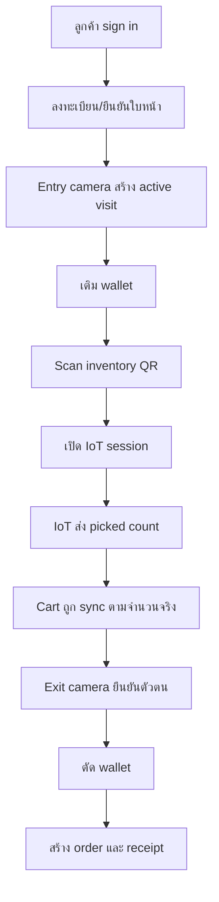

# Business ของ ATK Store

เอกสารนี้อธิบาย logic ธุรกิจ, condition, และกฎที่ทำให้ระบบ ATK Store ทำงานเป็นร้านค้าแบบหยิบสินค้าเอง

## Product idea

ATK Store จำลองร้านค้าที่ลูกค้าหยิบสินค้าเองได้โดยไม่ต้องจ่ายที่แคชเชียร์ ระบบใช้ face recognition เพื่อรู้ว่าใครเข้า/ออก, ใช้ QR เพื่อเลือกสินค้า/ตู้, ใช้ IoT เพื่อยืนยันจำนวนที่หยิบจริง และใช้ wallet เพื่อตัดเงินอัตโนมัติ

## Business flow หลัก

## เงื่อนไขก่อนลูกค้าจะ scan QR ได้

ลูกค้าจะ scan ได้เมื่อผ่านทุกเงื่อนไขนี้:

| เงื่อนไข                                     | ถ้าไม่ผ่าน                                            |
| -------------------------------------------- | ----------------------------------------------------- |
| มี active visit จาก entry camera             | แสดงข้อความให้เดินผ่านกล้องทางเข้าก่อน                |
| มี wallet                                    | ระบบพยายามสร้าง/ดึง wallet ถ้าล้มเหลวให้ติดต่อพนักงาน |
| wallet status เป็น `active`                  | ห้าม scan และให้ติดต่อพนักงาน                         |
| มี inventory ที่ active และ amount มากกว่า 0 | แจ้งว่ายังไม่มีสินค้าพร้อมขาย                         |
| wallet balance พอสำหรับสินค้าราคาต่ำสุด      | ให้เติม wallet ก่อน scan                              |

หลักคิดของ rule นี้คือป้องกันไม่ให้ลูกค้าเปิดตู้หรือเริ่ม IoT session ในสภาพที่ระบบยัง checkout ไม่ได้

## Customer journey

### 1. Sign in

- ใช้ Google OAuth
- สร้าง application session ด้วย cookie `atk_session`
- user ปกติมี role `client`
- ถ้า email มี pending role grant ระบบรับ admin role อัตโนมัติหลัง sign in

### 2. Face enrollment

- ลูกค้าลงทะเบียนใบหน้าที่ `/register-face`
- ระบบใช้ Amazon Rekognition Face Liveness ก่อน index face
- สถานะผู้ใช้คือ `not_registered`, `pending`, หรือ `registered`
- DB เก็บ metadata และ FaceId เท่านั้น ไม่เก็บ raw selfie video หรือ face vector

### 3. Entry camera

- Camera worker ส่งภาพมาที่ attendance API
- ระบบหา face match กับ Rekognition collection
- ถ้า user active และ match ได้ จะสร้าง `client_visit` status `inside`
- มีได้หนึ่ง open visit ต่อ user

### 4. Scan และหยิบสินค้า

- QR ผูกกับ inventory หนึ่งรายการหรือหลายรายการ
- ถ้า QR มีหลาย inventory ลูกค้าต้องเลือกก่อน
- การเปิดสินค้าเรียก IoT server เพื่อสร้าง pick session
- ระบบสร้าง `iot_session` และรอ event จาก IoT/MQTT
- picked count เป็น cumulative count จึงแทนจำนวนล่าสุดในตะกร้า ไม่ใช่จำนวนที่บวกเพิ่มทุก event

### 5. Cart

- Cart บน client แสดงสินค้าที่ IoT ยืนยันแล้ว
- ฝั่ง server sync cart ตาม active visit เพื่อให้ checkout ตัดยอดจากข้อมูลที่เชื่อถือได้
- หน้า cart ไม่มีปุ่ม checkout เพราะ checkout ผูกกับการเดินออกจากร้าน

### 6. Exit camera และ payment

- เมื่อ exit camera ยืนยันตัวตน ระบบปิด visit เป็น `exited`
- ระบบตัดเงินจาก wallet ตาม synced cart
- ถ้ายอดพอ จะสร้าง wallet ledger, order, order payment, receipt และ clear cart
- ถ้ายอดไม่พอ จะสร้าง notification ให้ลูกค้า/admin และ checkout fail

## Wallet และ payment rules

| เรื่อง        | Rule                                                    |
| ------------- | ------------------------------------------------------- |
| Currency      | ใช้ THB และ minor unit เป็น satang ใน wallet/receipt    |
| Top-up        | ใช้ Stripe Checkout                                     |
| Channel       | รองรับ `card` และ `promptpay`                           |
| Amount range  | default 10-20,000 บาท ต่อ top-up intent                 |
| Ledger        | ทุก credit/debit มี idempotency key                     |
| Order debit   | ใช้ key รูปแบบ `order:{clientVisitId}:{cartSessionId}`  |
| Top-up credit | ใช้ key รูปแบบ `topup:{topupIntentId}`                  |
| Webhook       | เก็บ Stripe event และกัน duplicate ด้วย `stripeEventId` |

## Order และ receipt rules

- Order ถูกสร้างเมื่อ wallet debit สำเร็จ
- Order ผูกกับ `clientVisitId`
- Payment method ปัจจุบันคือ `wallet`
- Receipt ออกทันทีหลัง order สำเร็จ
- Receipt number ใช้รูปแบบ `{prefix}{yyyy}{mm}{dd}-{orderIdSegment}`
- VAT เป็นแบบ included in price
- การเปลี่ยน Receipt Settings มีผลกับ receipt ที่ออกหลังจากบันทึกเท่านั้น

## Inventory rules

| เรื่อง        | Rule                                                                 |
| ------------- | -------------------------------------------------------------------- |
| Unit          | ต้องสร้าง unit ก่อนใช้กับ inventory                                  |
| Inventory     | มี name, price, amount, weight per piece, unit, active status        |
| Amount        | ใช้เป็นจำนวนในระบบ/back-office; IoT อาจรายงาน current qty ของตู้จริง |
| Delete        | ใช้ soft delete ผ่าน `deletedAt`                                     |
| QR            | หนึ่ง QR ผูก inventory ได้หนึ่งหรือหลายรายการ                        |
| Grouped QR    | ลูกค้าต้องเลือก inventory ก่อนเปิด IoT session                       |
| Shelf mapping | ฝั่ง code ระบุว่า IoT เป็นเจ้าของ physical shelf mapping             |

## IoT business rules

- App สร้าง session UUID แล้วส่งให้ IoT server
- Topic MQTT ใช้ pattern `{sessionId}/loadcell/{branchCode}/{inventoryId}/{event|status}`
- Event ชนิด `event` ต้องมี `sessionSummary.takenTotal`
- Status ชนิด `status` รองรับ `shelf_closed`
- `sessionSummary.takenTotal` ต้องเป็น non-negative integer
- branch ใน topic/payload ต้องตรงกับ `BRANCH_CODE`
- sku ใน payload ถ้ามี ต้องตรงกับ inventory id ใน topic
- เมื่อ IoT ส่ง picked count ระบบ sync cart และสร้าง notification
- เมื่อ IoT ส่ง door closed ระบบปิด IoT session แต่ checkout ยังเกิดตอน exit camera

## Attendance rules

| Direction  | ผลทางธุรกิจ                              |
| ---------- | ---------------------------------------- |
| `entry`    | สร้าง active visit ถ้ายังไม่มี           |
| `exit`     | ปิด active visit และพยายาม checkout      |
| `sighting` | บันทึก event แต่ไม่เปิด/ปิด visit โดยตรง |

ระบบจะไม่นับ user ที่ `blocked`, `disabled`, หรือ disabledUntil ยังไม่หมดเวลาเป็น active user สำหรับ attendance

## Role และ permission

| Role          | ความสามารถ                                                               |
| ------------- | ------------------------------------------------------------------------ |
| `client`      | ใช้งานหน้าลูกค้า                                                         |
| `admin`       | เข้า `/admin`, จัดการ client, inventory, wallet dashboard, demo controls |
| `super_admin` | ทำได้เหมือน admin และจัดการ admin role                                   |

กฎสำคัญ:

- Admin จัดการได้เฉพาะ client
- Super Admin จัดการ admin ได้ แต่จัดการ super_admin คนอื่นไม่ได้
- ไม่มีใครจัดการตัวเองผ่าน admin action
- Action สำคัญถูกบันทึกใน `admin_audit_logs`

## Business conditions ที่ต้องจำ

- ลูกค้า scan ไม่ได้ถ้ายังไม่ได้เข้า store ผ่านกล้อง
- ลูกค้า scan ไม่ได้ถ้า wallet มีเงินน้อยกว่าสินค้าราคาต่ำสุด
- Checkout ไม่ได้ถ้าไม่มี synced cart
- Checkout ต้อง idempotent เพื่อกันการตัดเงินซ้ำ
- Reset face enrollment ใน back-office ลบ mapping ใน DB แต่ metadata ระบุว่า AWS collection ไม่ถูกลบโดย action นี้
- Manual exit ใน `/admin/attendance` ใช้ checkout path เดียวกับ exit camera จึงมีผลจริงกับ wallet/order

## Out of scope ปัจจุบัน

- ระบบคืนเงิน/refund แบบสมบูรณ์
- Inventory reservation แบบ real-time ต่อ stock จริง
- Production-grade biometric retention policy ที่ละเอียดกว่านี้
- Payment method อื่นนอกจาก wallet
- Multi-branch operation เต็มรูปแบบ แม้มี `BRANCH_CODE`

## Glossary

| คำ              | ความหมายใน business context                                      |
| --------------- | ---------------------------------------------------------------- |
| Wallet          | ยอดเงินของลูกค้าในระบบ ใช้ตัดเงินตอนออกจากร้าน                   |
| Active visit    | สถานะว่าลูกค้าอยู่ในร้านและยังไม่ออก                             |
| Pick session    | session ที่ app เปิดกับ IoT เพื่อให้ตู้รู้ว่าลูกค้ากำลังหยิบอะไร |
| Picked count    | จำนวนสะสมที่ IoT รายงาน ไม่ใช่ delta                             |
| Checkout        | การตัด wallet และสร้าง order/receipt                             |
| Idempotency     | การเรียกซ้ำแล้วไม่เกิดผลซ้ำ เช่น ไม่ตัดเงินซ้ำ                   |
| Face profile    | mapping ระหว่าง user กับ Rekognition FaceId                      |
| Manual override | การปรับสถานะด้วย admin เพื่อ demo หรือแก้สถานการณ์เฉพาะหน้า      |
