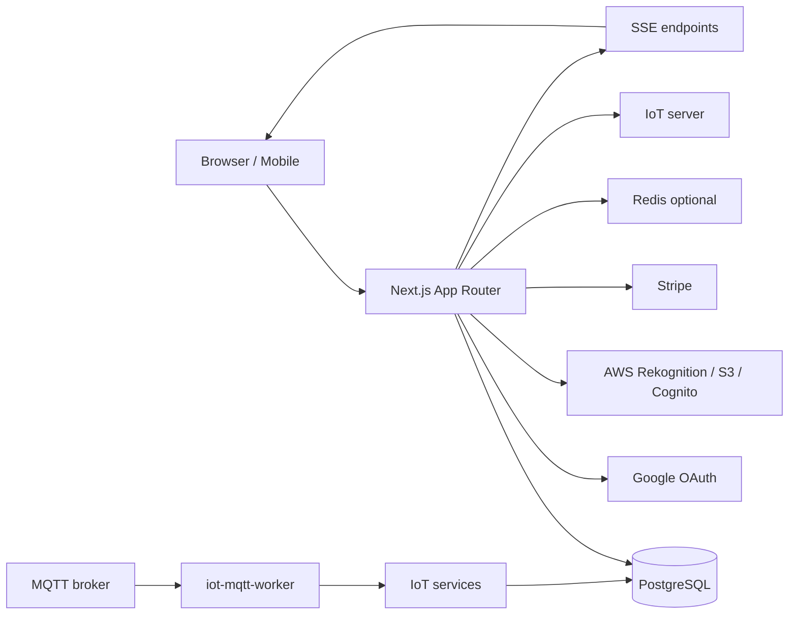

# Technical Architecture ของ ATK Store

เอกสารนี้อธิบายองค์ประกอบทางเทคนิค, third-party libraries/projects, integration, data model และ condition สำคัญของ codebase ปัจจุบัน

## Snapshot

| เรื่อง     | รายละเอียด                                       |
| ---------- | ------------------------------------------------ |
| Framework  | Next.js 16.2.9 App Router                        |
| Runtime UI | React 19.2.4                                     |
| Language   | TypeScript                                       |
| Styling    | Tailwind CSS v4, shadcn/ui, Base UI              |
| Database   | PostgreSQL + Drizzle ORM                         |
| Auth       | Custom Google OAuth + DB-backed session          |
| Payments   | Stripe Checkout + Stripe webhook                 |
| Face       | Amazon Rekognition Face Liveness/Face Collection |
| IoT        | HTTP IoT server, MQTT broker, MQTT worker, SSE   |
| State      | Zustand cart + server-side cart sync             |
| Testing    | Vitest, ESLint                                   |

## Directory map

| Path                        | หน้าที่                                                               |
| --------------------------- | --------------------------------------------------------------------- |
| `src/app`                   | App Router pages, layouts, route handlers, server actions             |
| `src/components`            | UI components และ client widgets                                      |
| `src/db`                    | Drizzle schema, database client, seed                                 |
| `src/lib`                   | auth helpers, AWS config, formatting, QR, money, permissions          |
| `src/services`              | business logic และ integration service ฝั่ง server                    |
| `src/store`                 | Zustand cart store                                                    |
| `src/types`                 | shared TypeScript types                                               |
| `script/iot-mqtt-worker.ts` | MQTT worker สำหรับรับ broker messages                                 |
| `drizzle`                   | migration output                                                      |
| `note`                      | project notes และเอกสารประกอบ                                         |
| `code_base_indexing`        | generated codebase index; ใช้เป็นตัวช่วย แต่ source จริงคือ canonical |

## Runtime architecture



## Next.js conventions ใน project

- ใช้ App Router
- หน้า server component เป็น default
- component ที่ต้องใช้ state/effect/browser API ต้องมี `"use client"`
- route handlers อยู่ใน `src/app/api/**/route.ts`
- server actions อยู่ในไฟล์ action ของแต่ละ area เช่น `src/app/admin/actions.ts`
- `proxy.ts` ทำหน้าที่ redirect guard ระดับหน้า แต่ API ต้องตรวจ auth เอง
- ใน Next.js 16 dynamic `params` และ `searchParams` เป็น `Promise` จึงต้อง `await`

## Auth architecture

Flow:

1. `/signin` แสดงปุ่ม sign in
2. `/api/auth/signin/google` สร้าง state, PKCE, nonce cookies
3. Google callback กลับมาที่ `/api/auth/callback/google`
4. server validate state/PKCE/nonce และ Google ID token
5. upsert user และ provider identity
6. สร้าง DB session แล้ว set cookie `atk_session`
7. route/private actions ใช้ `requireCurrentUser()`

Security notes:

- DB เก็บ hash ของ session token ไม่เก็บ raw cookie token
- sign out เป็น POST และตรวจ same-origin
- user ที่ถูก block/disable ถูกลบ session เมื่อ admin action ทำงาน
- role ถูก derive จาก `roles` และ `user_roles`

## Face Liveness และ Face Recognition

Third-party:

- `@aws-amplify/ui-react-liveness`
- `@aws-amplify/ui-react`
- `aws-amplify`
- `@aws-sdk/client-rekognition`
- `@aws-sdk/client-cognito-identity`
- `@aws-sdk/client-s3`

Flow enrollment:

1. server สร้าง Rekognition Face Liveness session
2. browser ใช้ temporary credentials จาก Cognito เพื่อ start detector
3. detector เรียก `onAnalysisComplete`
4. server อ่าน result ด้วย `GetFaceLivenessSessionResults`
5. ถ้าผ่าน threshold จึง search duplicate และ index face
6. DB เก็บ FaceId, ImageId, S3 key metadata และสถานะ user

Condition สำคัญ:

- หนึ่ง user มี pending liveness attempt ได้หนึ่งรายการ
- normal attempt ใช้ Create + Start + Get
- ไม่มี polling Rekognition; transient result retry ได้จำกัด
- verification intent ห้าม index face ใหม่
- raw selfie video ไม่ถูกเก็บใน app DB
- browser ไม่ได้รับ backend AWS credentials

## Wallet และ Stripe

Third-party:

- `stripe`

Service หลัก:

- `walletService.getWalletOverview`
- `walletService.createTopUpCheckoutSession`
- `walletService.handleStripeWebhook`
- `walletService.payOrderFromWallet`

Data ที่เกี่ยวข้อง:

- `wallets`
- `wallet_ledger_entries`
- `stripe_customers`
- `wallet_funding_channels`
- `wallet_topup_intents`
- `stripe_webhook_events`
- `order_payments`

Condition:

- ใช้ THB minor unit สำหรับ wallet/ledger/receipt
- top-up สำเร็จเมื่อ Stripe webhook ยืนยัน paid
- webhook event ถูก dedupe ด้วย `stripeEventId`
- ledger ใช้ idempotency key กัน double credit/debit
- order checkout update wallet ใน transaction

## IoT, MQTT และ SSE

Third-party:

- `mqtt`
- Redis package `redis` สำหรับ pub/sub fallback ในบาง service

Service หลัก:

- `iotService`
- `iotSessionService`
- `iotEventProcessorService`
- `iotMqttMessageHandler`
- `iotSessionEventsService`
- `cartSyncService`

Flow:

1. ลูกค้าเปิด `/inventory/[id]`
2. client เรียก `POST /api/iot/watch`
3. server ตรวจ active visit และ inventory
4. server call IoT server หรือ mock IoT server
5. server สร้าง `iot_sessions`
6. IoT/MQTT ส่ง event กลับ
7. worker/service normalize event
8. server update session, cart sync, notification
9. client รับ update ผ่าน SSE

MQTT topic:

```text
{sessionId}/loadcell/{branchCode}/{inventoryId}/{event|status}
```

Payload event ตัวอย่าง:

```json
{
  "deviceId": "mock-device",
  "branch": "main",
  "event": "item_picked",
  "seq": 1,
  "sku": "inventory-uuid",
  "sessionSummary": { "takenTotal": 2 },
  "currentQty": 8,
  "timestamp": "2026-07-15T00:00:00.000Z"
}
```

Payload status ตัวอย่าง:

```json
{
  "deviceId": "mock-device",
  "branch": "main",
  "seq": 2,
  "online": true,
  "status": "shelf_closed",
  "timestamp": "2026-07-15T00:00:05.000Z"
}
```

## QR architecture

Third-party:

- `qrcode`
- `html-to-image`

ส่วนที่เกี่ยวข้อง:

- `src/lib/qr-payload.ts`
- `src/lib/qr-image.ts`
- `src/app/admin/inventory/_qr-code-builder.tsx`
- `qr_codes` table

QR เก็บ encoded payload ที่บอก inventory ids ถ้ามีหลาย id จะพาไปเลือกสินค้าที่ `/scan/inventories`

## Storage

Service:

- `s3StorageService`

ใช้สำหรับ:

- อัปโหลดรูป inventory
- อัปโหลด QR image
- เก็บ reference S3 key จาก Face Liveness output

Condition:

- secret key อยู่ฝั่ง server เท่านั้น
- รูปที่ไม่มี file ใหม่จะใช้ URL เดิมหรือ input imageUrl

## Data model หลัก

| กลุ่ม           | Tables                                                                                                                             |
| --------------- | ---------------------------------------------------------------------------------------------------------------------------------- |
| Auth/Roles      | `users`, `sessions`, `roles`, `user_roles`, `role_grants`, `admin_audit_logs`                                                      |
| Face            | `face_liveness_attempts`, `user_face_profiles`                                                                                     |
| Attendance      | `client_attendance_events`, `client_visits`                                                                                        |
| Inventory/QR    | `units`, `inventories`, `qr_codes`                                                                                                 |
| IoT             | `iot_sessions`, `iot_session_events`, `iot_mqtt_message_logs`                                                                      |
| Wallet/Stripe   | `wallets`, `wallet_ledger_entries`, `stripe_customers`, `wallet_funding_channels`, `wallet_topup_intents`, `stripe_webhook_events` |
| Orders/Receipts | `orders`, `order_items`, `order_payments`, `store_settings`, `receipts`, `receipt_items`                                           |
| Notifications   | `notifications`                                                                                                                    |

## API surface สำคัญ

| Route                                      | ใช้ทำอะไร                                     |
| ------------------------------------------ | --------------------------------------------- |
| `GET /api/health-check`                    | health check                                  |
| `GET /api/auth/signin/google`              | เริ่ม Google OAuth                            |
| `GET /api/auth/callback/google`            | callback และสร้าง session                     |
| `POST /api/auth/signout`                   | sign out                                      |
| `GET /api/face/auth-status`                | ตรวจ face token preflight                     |
| `GET /api/face/credentials`                | ขอ temporary credentials สำหรับ Face Liveness |
| `POST /api/face/session`                   | สร้าง/reuse liveness session                  |
| `POST /api/face/result`                    | อ่าน liveness result และ register/verify      |
| `POST /api/iot/watch`                      | เปิด inventory IoT session                    |
| `GET /api/iot/sessions/[sessionId]`        | อ่าน session status                           |
| `GET /api/iot/sessions/[sessionId]/events` | SSE ของ IoT session                           |
| `POST /api/iot/events`                     | รับ IoT event normalized                      |
| `POST /api/iot/mock-events`                | ส่ง mock event จาก admin                      |
| `GET /api/orders/active-visit-status`      | อ่าน checkout status ล่าสุด                   |
| `GET /api/orders/active-visit-events`      | SSE checkout status                           |
| `POST /api/client-attendance/recognize`    | camera recognition                            |
| `POST /api/client-attendance/exit-order`   | exit checkout helper                          |
| `POST /api/stripe/webhook`                 | Stripe webhook                                |
| `POST /api/qr/decode`                      | decode QR payload                             |

## Third-party libraries/projects

| Package / Service         | ใช้เพื่อ                              |
| ------------------------- | ------------------------------------- |
| Next.js                   | Full-stack web framework              |
| React                     | UI runtime                            |
| TypeScript                | type safety                           |
| Tailwind CSS              | styling                               |
| shadcn/ui                 | reusable UI primitives                |
| Base UI                   | UI primitive support                  |
| lucide-react              | icons                                 |
| Drizzle ORM / drizzle-kit | schema, migration, query              |
| postgres                  | PostgreSQL driver                     |
| PostgreSQL                | primary database                      |
| Zustand                   | client cart state                     |
| jose                      | JWT/OIDC token validation             |
| AWS SDK                   | Rekognition, S3, Cognito integration  |
| AWS Amplify UI Liveness   | browser liveness detector             |
| Stripe                    | wallet top-up and webhook             |
| mqtt                      | MQTT broker client/worker             |
| redis                     | pub/sub or sync support where enabled |
| qrcode                    | QR image generation                   |
| html-to-image             | image export support                  |
| Vitest                    | tests                                 |
| ESLint / Prettier         | code quality and formatting           |
| Docker / docker-compose   | local services such as MQTT           |

## Technical conditions

- API ที่ mutate ต้องใช้ `requireCurrentUser()` และ same-origin guard ตามความเสี่ยง
- Admin layout ตรวจ `adminUserService.getActor()`
- `proxy.ts` เป็น redirect guard ไม่ใช่ authorization boundary ที่แท้จริง
- IoT event ต้องผ่าน contract normalization ก่อน update session
- Cart server sync คือแหล่งข้อมูล checkout ไม่ใช่แค่ localStorage
- Wallet debit, order, payment, receipt อยู่ใน transaction เดียว
- Soft delete ใช้ `deletedAt` ในหลาย master tables
- `code_base_indexing` อาจ stale ได้ ต้องเช็ค source จริงเสมอ

## Glossary

| คำ               | ความหมายทางเทคนิค                                                    |
| ---------------- | -------------------------------------------------------------------- |
| App Router       | routing system ของ Next.js ที่ใช้ `src/app`                          |
| Route Handler    | API handler ใน `route.ts`                                            |
| Server Action    | function ฝั่ง server ที่ form/action เรียกได้                        |
| Proxy            | Next.js 16 replacement ของ middleware สำหรับ request guard เบื้องต้น |
| SSE              | Server-Sent Events ใช้ push status ไป browser                        |
| Idempotency key  | key กันการประมวลผลซ้ำ เช่น wallet debit ซ้ำ                          |
| Face Collection  | AWS Rekognition collection ที่เก็บ face features                     |
| Liveness attempt | session ตรวจว่าเป็นคนจริงก่อน register/verify face                   |
| Minor unit       | หน่วยย่อยของเงิน เช่น satang                                         |
| Soft delete      | ลบเชิงธุรกิจโดย set `deletedAt` แต่ไม่ลบ row จริง                    |
